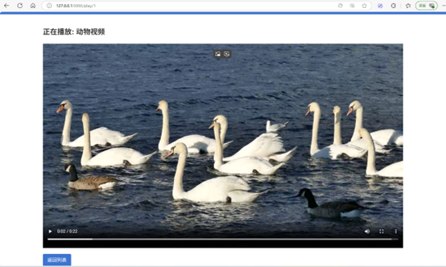
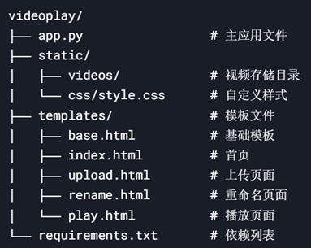
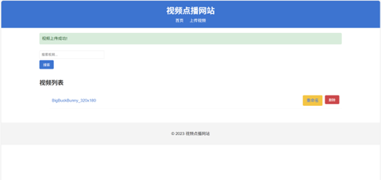
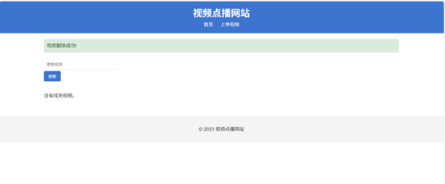
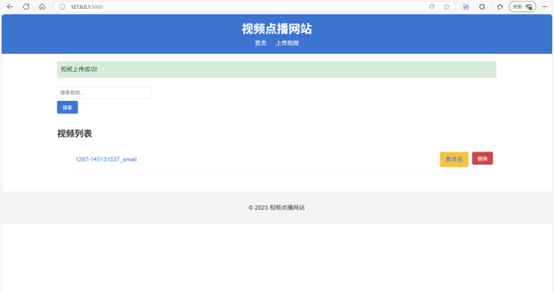
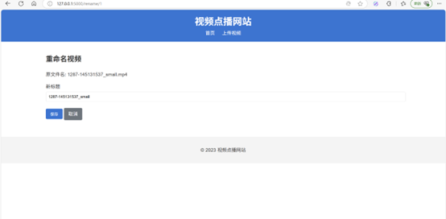
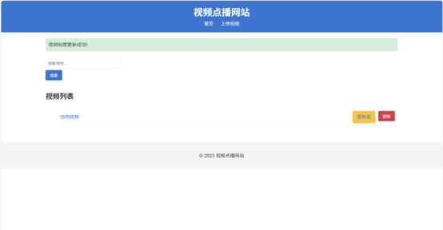
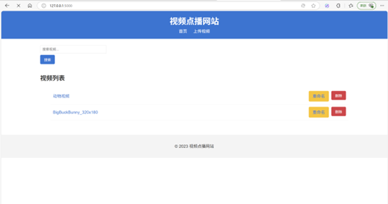
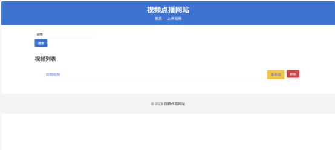
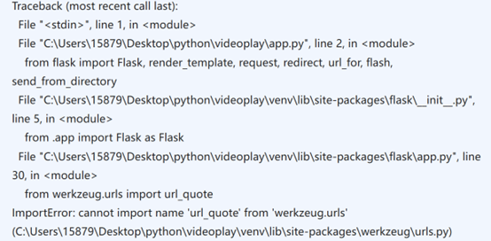

# 借助DeepSeek开发的视频点播网站 videoplay

## 1. 项目概述

VideoPlay 是一个基于 Flask 框架的视频点播网站，实现了视频上传、播放、删除、重命名和搜索等核心功能。本项目采用 Python 3 开发，使用 SQLite 作为数据库，前端基于 HTML5 + Bootstrap 构建。借助deepseek辅助开发。


## 2. 技术栈

- 后端框架: Flask 2.3.2
- 数据库: SQLite + Flask-SQLAlchemy 3.0.2
- 前端: HTML5 + Bootstrap 5 + Jinja2 模板
- 视频处理: HTML5 video 标签
- 表单处理: Flask-WTF 1.1.1

## 3. 项目结构



## 4. 核心功能实现

### 4.1 功能一：视频上传（增）

增的功能主要体现在视频上传上，用户可以在网页中上传自己本地存储的视频。


**实现逻辑:**

- 接收前端上传的文件
- 验证文件类型（仅允许 mp4/webm/ogg）
- 保存文件到 `static/videos` 目录
- 将视频信息存入数据库
- 返回操作结果

### 4.2 功能二：视频删除（删）

根据 ID 获取视频记录，删除服务器上的视频文件，删除数据库记录。


### 4.3 功能三：视频重命名（改）

改的功能主要体现在视频标题的重命名，用户可对已经上传的视频进行改名。因此需要获取要修改的视频，显示当前标题供编辑，提交后更新数据库中的标题字段。




### 4.4 功能四：视频搜索（查）



**实现逻辑:**

- 接收搜索关键词
- 在视频标题中进行模糊匹配
- 返回匹配结果列表
- 无关键词时显示全部视频（按上传时间倒序）

## 5. 前端实现

实现的页面：

- 网页横幅（base.html）
- 首页（index.html）
- 视频播放页面 (play.html)
- 视频上传页面（upload.html）
- 视频搜索页面（search.html）
- 视频播放页面（rename.html）

## 6. 部署说明

### 6.1 安装依赖

本项目基于flask2.3.2后端架构进行开发，前端使用Jinja2模版，主要开发语言是 Python，因此需要使用一些库。

`requirements.txt` 中已经给出了需要下载的依赖和库：
- flask==2.3.2
- Werkzeug==2.3.7
- Flask-WTF==1.2.1
- Flask-SQLAlchemy==3.0.2
- WTForms==3.0.1
- python-dotenv==0.19.0

> **注意**：不推荐使用 flask 2.2x 的版本搭配 Werkzeug ≥ 2.2.2，因为在 flask2.2x版本中存在不兼容的问题：
>
> 因此使用 flask 2.3.2 会更稳定。

### 6.2 部署运行

首先需要激活python虚拟环境，终端powershell中输入：
```
.\venv\Scripts\Activate.ps1
```
首次运行时需要初始化数据库，在终端powershell中输入：
```
python -c "from app import app, db; with app.app_context(): db.create_all()"
```
最后输入指令即可运行：
```
flask run
```

